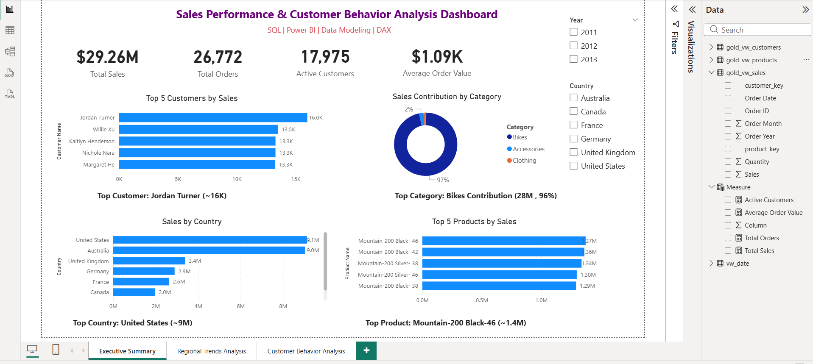
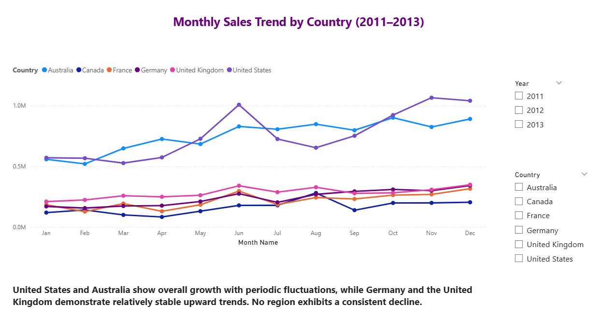
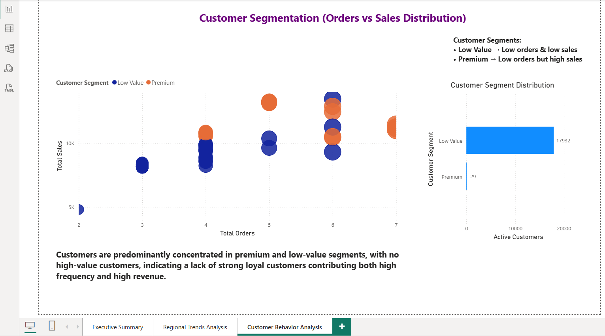

# Sales Performance & Customer Behavior Analysis Dashboard

## 📊 Project Overview
This project analyzes sales data to identify key revenue drivers, regional performance trends, and customer purchasing behavior.

## 🎯 Objectives
- Identify top customers, products, and regions
- Analyze regional sales trends over time
- Understand customer purchasing behavior and segmentation

## 🛠 Tools Used
- SQL Server
- Power BI
  
##   Concepts
- Data Preparation
- Data cleaning
- Data Modeling
- DAX
- Visualization
  
## 📈 Dashboard Pages
1. Executive Summary
2. Regional Trends
3. Customer Behaviour

## 📌 Key Insights
- United States and Australia are top revenue contributors
- No region shows consistent decline
- Majority customers are low-value, indicating lack of strong loyalty base
- Bikes category contributes ~96% of total sales

## GitHub repo structure 
datasets/
docs/
images/
powerbi/
sql/
README

